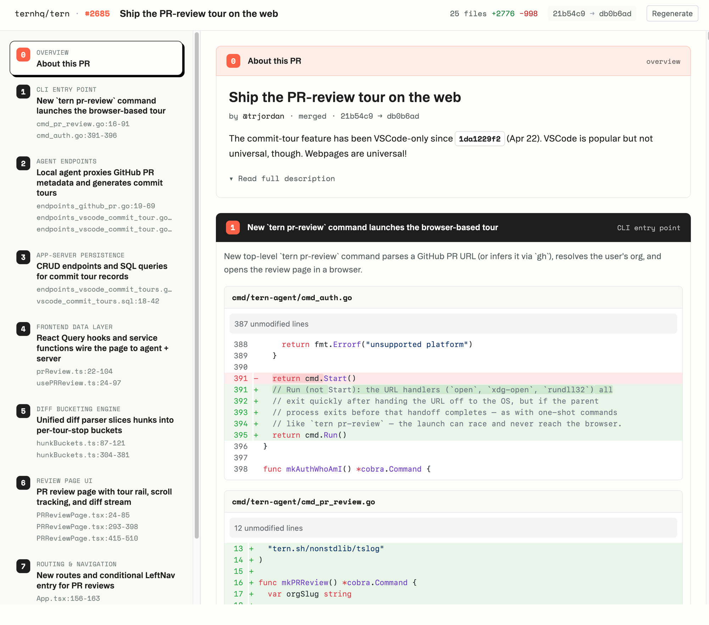

# Tern Tour - an agent plugin

Set up [Tern](https://tern.sh) and open an AI-guided tour of any branch or
GitHub pull request, from inside Claude Code, Codex, or any agent.

A 47-file change isn't 47 unrelated edits. Tern groups it by what's changing
together, and gives each group a paragraph of context with pointers to the
load-bearing lines. Mechanical churn (renames, formatting, import shuffles)
gets demoted so your attention lands where it matters.



## Install

In Claude Code:

```text
/plugin marketplace add ternhq/tern-claude-plugin
/plugin install tern-tour@tern
```

## Use

From a checkout of the repo, just ask your agent:

> review this branch with tern

The agent picks up the skill on its own. Or invoke it explicitly, with no
argument:

```text
/tern-tour:tour
```

That tours whatever branch you have checked out. If the branch has an open PR
you get its tour; if not, you get your local branch compared against its
merge-base. The common case is the thing you're already looking at, so you
rarely pass anything.

To review a PR you don't have checked out, pass its URL from anywhere:

```text
/tern-tour:tour https://github.com/owner/repo/pull/123
```

The tour opens in your browser: stops on the left rail, the diff on the right,
each hunk grouped under the stop that explains it.

## What it does

The skill is self-contained and sets everything up on first run:

1. **Installs the `tern` CLI** if it's missing
   (`curl -fsSL https://tern.sh/install.sh | bash`).
2. **Runs `tern pr-review`**, which links the repo on the way through and
   opens the tour.

No browser available, like a remote or CI shell? It falls back to
`tern pr-review --post-draft`, which posts the tour as a pending GitHub review
instead of opening a page.

## Requirements

- macOS or Linux (the CLI installer is `curl … | bash`)
- A local git checkout of the repo you want to review
- The [`gh` CLI](https://cli.github.com), authenticated. The branch path uses
  it to find the branch's PR; passing an explicit PR URL is the only way to
  skip it.
- An account on app.tern.sh. A randomly generated one is created for you on
  first run, with credentials stored in `~/.tern`.

## Learn more

- [Tours](https://tern.sh/docs/pr-tours): what a tour is, and the three ways
  to read one (browser, VS Code, or posted as a GitHub review)
- [Quickstart](https://tern.sh/docs/install): the CLI on its own, without an
  agent
- [tern.sh](https://tern.sh): what Tern is
